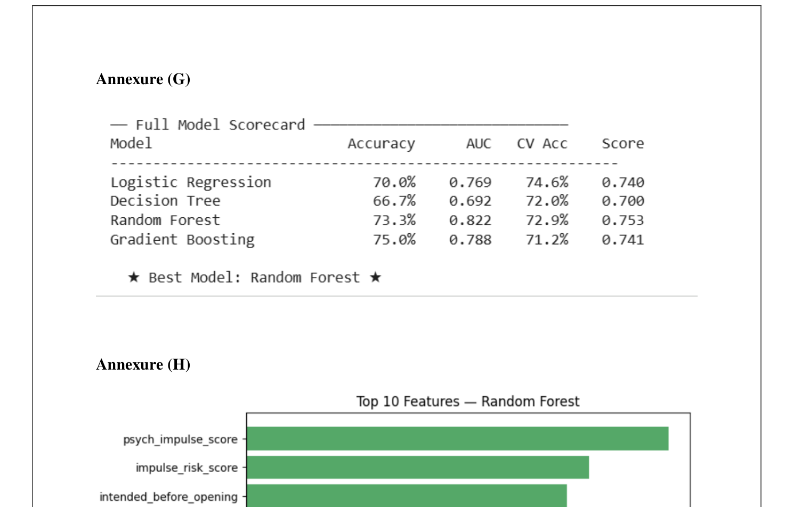
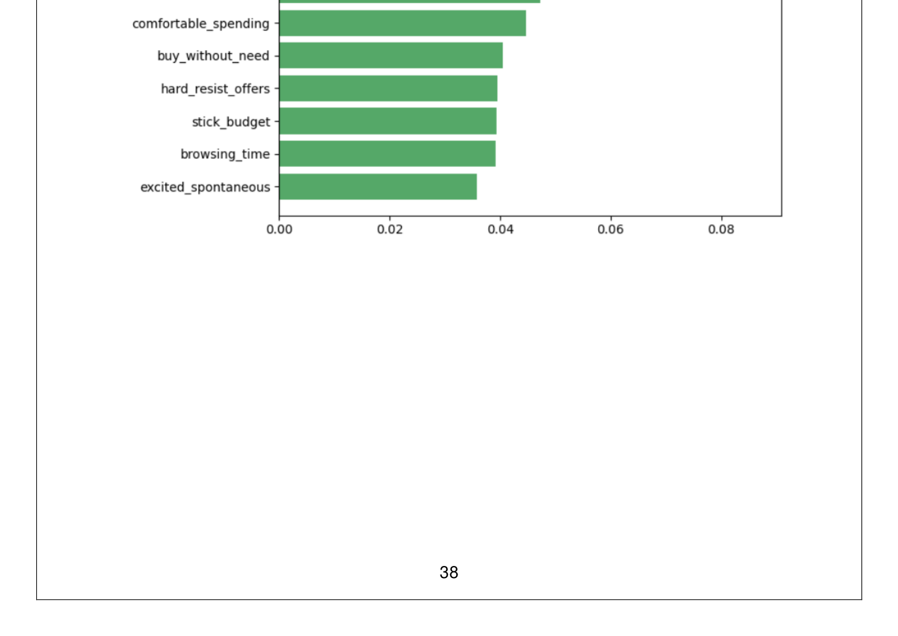
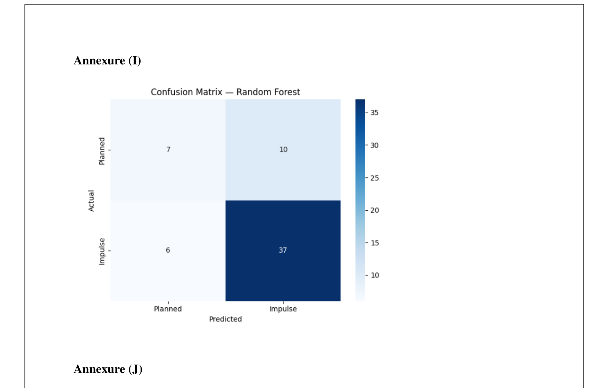

# Impulse-Buying-Behavior-Prediction
ML-based consumer analytics project predicting impulse buying behavior using psychological and environmental factors. Based on primary survey data collected from 295 online shoppers.

---

## Problem Statement

E-commerce platforms use flash sales, discounts, push notifications, and influencer marketing to drive purchases. But which factors actually trigger impulse buying — and can they be predicted?

This study analyzes both psychological factors (FOMO, emotional influence, stress-based shopping) and environmental triggers (discounts, limited-time offers, peer recommendations) to build a machine learning model that classifies whether a purchase is impulsive or planned.

---

## Project Highlights

- Collected primary data from 295 respondents via structured Google Forms survey
- Analyzed 33 variables across demographics, psychology, environment, and behavior
- Found 72% of respondents classified their recent purchase as impulse or partially planned
- Built and compared 4 ML models — best model achieved 75% accuracy
- Identified top predictors using feature importance analysis
- Segmented consumers into Low, Moderate, and High impulse buyer categories

---

## Dataset

| Field | Details |
|---|---|
| Source | Primary data — structured online survey (Google Forms) |
| Responses | 295 valid responses |
| Variables | 33 columns |
| Target Variable | Purchase classification (Planned / Partially Planned / Completely Unplanned) |
| Binary Target | 1 = Impulsive, 0 = Planned |
| Class Distribution | Impulse buyers: 72% / Planned buyers: 28% |

**Variable Categories:**
- Demographics — age, gender, occupation, device, platform
- Purchase behavior — planned vs unplanned, browsing time, purchase intent
- Psychological factors — FOMO, stress buying, mood shopping, emotional influence
- Environmental triggers — discounts, limited-time offers, push notifications, influencer influence
- Behavioral patterns — price comparison, cart abandonment, budget adherence
- Engineered features — psych_impulse_score, env_trigger_score, self_control_score, impulse_risk_score

---

## Tech Stack

| Category | Tools |
|---|---|
| Language | Python |
| Environment | Google Colab |
| Data Processing | Pandas, NumPy |
| Visualisation | Matplotlib, Seaborn |
| Machine Learning | Scikit-learn |

---

## Methodology

### 1. Data Collection
Primary data collected via structured questionnaire distributed through WhatsApp and online platforms. Questions used Likert scale (1–5) for psychological and behavioral variables.

### 2. Data Preprocessing
- Handled missing values and encoded categorical variables
- Engineered composite scores: psychological impulse score, environmental trigger score, self-control score, impulse risk score
- 80:20 train-test split with stratification (236 training / 60 test samples)

### 3. Exploratory Data Analysis
- Psychological variables (FOMO, emotional influence) showed higher average values among impulse buyers
- Environmental triggers (discounts, limited-time offers) strongly associated with unplanned purchases
- Faster browsing time and lower price comparison frequency correlated with impulse buying

### 4. Model Training & Evaluation

## Visualisations

### Model Scorecard


### Feature Importance


### Confusion Matrix


---

## Key Findings

- FOMO was the strongest psychological predictor of impulse buying
- Emotional influence during shopping and difficulty resisting offers were next most significant
- Discounts and limited-time offers were the top environmental triggers
- Respondents who spent less than 5 minutes browsing were significantly more likely to make impulse purchases
- 72% of respondents reported making impulse or partially planned purchases in their most recent session

---

## Top 10 Features (Random Forest)

1. psych_impulse_score
2. impulse_risk_score
3. intended_before_opening
4. self_control_score
5. comfortable_spending
6. buy_without_need
7. hard_resist_offers
8. stick_budget
9. browsing_time
10. excited_spontaneous

---

## Consumer Segmentation

| Segment | Description |
|---|---|
| Low Impulse Buyers | Mostly make planned purchases, high self-control scores |
| Moderate Impulse Buyers | Occasionally make impulsive purchases, influenced by strong discounts |
| High Impulse Buyers | Frequently buy impulsively, high FOMO and emotional influence scores |

---

## Project Structure

├── Capstone.ipynb                          # Main notebook — EDA, modelling, evaluation
├── survey_data.csv                         # Raw survey responses (295 rows, 33 columns)
├── Harshit_Saraf_Capstone_Project.pdf      # Full project report
├── assets/
│   ├── model_scorecard.png
│   ├── feature_importance.png
│   └── confusion_matrix.png
└── README.md

---

## How to Run

```bash
git clone <repo-url>
pip install -r requirements.txt
# Open Capstone.ipynb in Google Colab or Jupyter
```

---

## Business Implications

- E-commerce platforms can use impulse risk scores to target high-impulse segments with flash sales
- Moderate impulse buyers can be nudged with personalized discount notifications
- Ethical consideration: excessive use of psychological triggers may lead to post-purchase regret

---

## Author

**Harshit Saraf**
PGDM Business Analytics — Vivekanand Education Society's Business School, Mumbai
Guided by: Prof. Nikita Ramrakhiani
[LinkedIn](https://www.linkedin.com/in/harshit-saraf-h9) · [GitHub](https://github.com/Happy295-hue)
